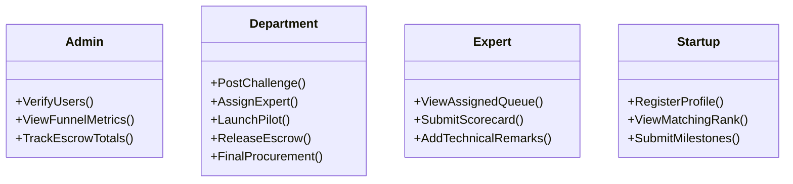

# GovStart: Architectural Blueprint & Implementation Roadmap

This blueprint details the design, user journeys, system architecture, testing strategy, and development roadmap for **GovStart**—a startup-friendly public procurement mechanism built for the **Government of Maharashtra (Maharashtra State Innovation Society)** to solve **SIH Problem Statement ID 26136**.

---

## 1. Problem Statement in Simple Language
Today, government departments face operational problems that could be solved by startups. However, government rules (like requiring 3+ years of experience and high financial turnovers) disqualify startups immediately. Furthermore, government officers do not know how to write "outcome-based" problems, struggle to evaluate cutting-edge technologies, and cannot legally buy from startups without running long, open public tenders where cheap copycats outbid quality innovations. 

This platform establishes a legally compliant **"Sandbox Sandbox"** where:
1.  Departments post challenges in terms of *outcomes* (what they want to achieve, not what technology to buy).
2.  Startups run controlled, low-risk **pilots** to prove their technology.
3.  Independent **academic experts** evaluate and score the results.
4.  Successful pilots can be **directly procured** by the department, bypassing standard public tenders.

---

## 2. The Root Problem
The root problem is **systemic mismatch in public procurement rules**:
*   **Legacy Compliance vs. Agile Innovation**: Rules like *GFR (General Financial Rules)* and *L1 (Lowest Bidder wins)* are optimized to buy standardized commodities (like chairs or paper) at the lowest cost. They are fundamentally incompatible with purchasing unique, unstandardized innovations (like AI waste sorters or drone mapping software) where value, rather than price, is the differentiator.

---

## 3. Stakeholders
*   **Government Department Nodal Officers**: Post challenges, oversee sandbox pilots, and authorize final procurement.
*   **Startups (DPIIT Registered)**: Discover challenges, match with needs, run pilots, and get paid.
*   **Academic Experts (Evaluators)**: University professors (COEP, VJTI, IIT) who act as independent technical validators.
*   **Super Admins (MSINS/Platform Owners)**: Monitor global pipeline metrics, verify users, and manage the system.

---

## 4. Current System / Gaps
*   **Spec-Writing Gaps**: Officers write rigid specifications instead of outcome requirements.
*   **Vetting Gaps**: Officers lack technical skills to judge if a startup’s AI or IoT tech is real or fake.
*   **Legal Gaps**: No legal templates exist to run a fast, 3-month pilot sandbox with a startup.
*   **Payment Gaps**: Delayed payments force startups to run out of cash during pilots.
*   **Scale-Up Gaps**: Even if a pilot succeeds, there is no direct path to buy it at scale without starting a brand new public tender.

---

## 5. Solution Brainstorming
Three fundamentally different approaches were evaluated:

### Approach A: The Bid-Free Sandbox (The Chosen GovStart Mechanism)
A controlled, legally protected sandbox pathway where the department funds a 3-month pilot. Independent professors vet the technology. On successful completion, the department gets legal approval for direct single-source procurement under Proprietary Article Certificate (PAC) rules.

### Approach B: Reverse Bidding Hackathon Portal
An open portal where departments post problems as hackathons. Startups compete, win cash prizes, and the winner gets a purchase order. 
*   *Gaps:* Does not address long-term pilot testing, data/IP ownership, or the legal transition to full-scale government contracts.

### Approach C: Managed Service Provider (MSP) Middleware
An intermediate government-owned corporation buys the startup's tech, bundles it as a managed service, and sells it to departments.
*   *Gaps:* High operational cost, creates a slow middleman, and increases bureaucratic delays.

---

## 6. Comparison of Solutions

| Dimension | Approach A (GovStart Sandbox) | Approach B (Hackathon Portal) | Approach C (MSP Middleware) |
| :--- | :--- | :--- | :--- |
| **Core Idea** | Outcome Sandbox + Expert Vetting + Direct PAC Buy | Hackathon Competition for Cash | Govt Middleman Reseller |
| **Advantage** | Resolves GFR legal barriers directly. | Simple to build and run. | Low risk for departments. |
| **Disadvantage** | Requires setting up escrow frameworks. | No long-term pilot verification. | Slows down procurement. |
| **Tech Complexity**| Medium (Escrow, matching, DTOs). | Low (CRUD forms). | High (Complex billing, invoicing). |
| **Judge Appeal** | High (Solves the GFR & L1 legal problem). | Low (Generic portal). | Medium (Administrative solution). |

---

## 7. The Final Optimal Solution: Approach A (GovStart)
GovStart is the optimal solution because it **directly targets the legal and structural blockages** of public procurement:
1.  It replaces rigid specifications with **outcome challenges**.
2.  It introduces **independent academic scorecards** to resolve the government's lack of technical vetting.
3.  It utilizes **escrow accounts** to guarantee startup cash flow.
4.  It produces the **legal audit trail** necessary to bypass L1 bidding and purchase directly via the GeM (Government e-Marketplace) portal under sandbox exemptions.

---

## 8. User Roles & Capabilities



---

## 9. Complete User Journeys

### Department Journey
Post Challenge &rarr; Run AI Matching &rarr; Review Recommendations &rarr; Assign Expert &rarr; Receive Scorecard &rarr; Launch Pilot (Lock Escrow) &rarr; Review Milestones &rarr; Authorize Direct Procurement.

### Startup Journey
Register Profile (DPIIT number) &rarr; Match with Challenges &rarr; Get Selected for Pilot &rarr; Submit Milestone Updates &rarr; Receive Escrow Payouts &rarr; Get Procured.

### Expert Journey
Log In &rarr; Access Matching Queue &rarr; Move Scorecard Sliders (Feasibility, Cost, etc.) &rarr; Write Technical Justification &rarr; Submit.

---

## 10. Platform Modules

```
┌─────────────────────────────────────────────────────────────────────────┐
│                                GOVSTART                                 │
├───────────────────┬────────────────────┬────────────────┬───────────────┤
│ 1. Challenge      │ 2. Matching        │ 3. Evaluation  │ 4. Sandbox    │
│    Postings       │    Engine (Gemini) │    Scorecard   │    Escrow     │
└───────────────────┴────────────────────┴────────────────┴───────────────┘
```

1.  **Challenge Postings**: Input forms for departments to structure goals. Output: standard challenges.
2.  **Matching Engine**: Calculates Jaccard index between startup capability tags and challenge needs, combined with Gemini semantic fit analysis.
3.  **Evaluation Scorecards**: 1-5 sliders for Technical Feasibility, Novelty, Team Capability, and Cost.
4.  **Sandbox Escrow**: Simulates locking pilot budget and releasing funds to the startup upon milestone approval.

---

## 11. System Architecture

```
                       ┌──────────────────────┐
                       │  React Vite Client   │
                       │     (Port 5173)      │
                       └──────────┬───────────┘
                                  │ (HTTP / JWT)
                                  ▼
                       ┌──────────────────────┐
                       │  Spring Boot Server  │
                       │     (Port 8080)      │
                       └──────────┬───────────┘
                                  ├───────────────────────┐
                                  ▼                       ▼
                       ┌──────────────────────┐┌──────────────────────┐
                       │      PostgreSQL      ││   Gemini API Layer   │
                       │     (Port 5432)      ││   (Semantic Match)   │
                       └──────────────────────┘└──────────────────────┘
```

---

## 12. Data Flow
1.  **Department** posts challenge.
2.  **Spring Boot** saves to PostgreSQL and triggers **Gemini API** to evaluate the semantic fit of all startups.
3.  **Matching Score** is calculated and stored in `recommendations`.
4.  **Expert** evaluates the startup, saving the ratings to `evaluations`.
5.  **Department** launches the pilot, creating a `Pilot` record.
6.  **Startup** submits `PilotUpdate` records, which update the project's completion percentage.
7.  **Department** submits `Decision`, updating `problems.status` to `DECIDED`.

---

## 13. Technology Stack
*   **Frontend**: React, Vite, Tailwind CSS v4, TypeScript.
*   **Backend**: Java 17+, Spring Boot, Spring Security, Hibernate.
*   **Database**: PostgreSQL.
*   **AI Integration**: Google Gemini REST API.

---

## 14. MVP Architecture
*   **Database**: Single local instance of PostgreSQL.
*   **Auth**: Stateless JWT authentication filter.
*   **AI Layer**: Synchronous REST calls to Gemini with fallback mock evaluations to prevent API quota issues during live demos.

---

## 15. Production Architecture
*   **Vector DB**: PGVector for fast semantic search across thousands of startups.
*   **State Machine**: Spring State Machine to strictly enforce problem and pilot status transitions.
*   **Escrow Integration**: Integration with municipal bank APIs or UPI Autopay for real fund escrow locking.
*   **PDF Generator**: Apache FOP or OpenPDF to output signed Pilot agreements and NDAs.

---

## 16. Development Phases

### Phase 1: Core System & Workflow (Completed)
*   **Objective**: Build database schema, auth, matching algorithm, expert scoring, pilot workspaces, and dashboards.
*   **Verification**: Tested via [walkthrough.md](file:///Users/tusharagarwal/.gemini/antigravity/brain/bedfbc54-fab9-4349-ae91-39e390882dbd/walkthrough.md).

### Phase 2: Advanced Controls & Templates (Targeting)
*   **Objective**: Implement legal document generators (NDAs, Pilot contracts), automated milestone payouts, and SLA auto-approvals.
*   **Database Changes**: Add templates configuration table, `sla_days` config, and `escrow_transaction_id` tracking.

---

## 17. Testing Strategy
GovStart employs a test-driven approach using mock database configurations and endpoint routing:

```
project-root/
│
└── test/
    ├── auth/
    │   └── login.test.ts
    ├── core/
    │   ├── challenge_post.test.ts
    │   └── matching_algorithm.test.ts
    ├── pilot/
    │   ├── milestone_update.test.ts
    │   └── escrow_payout.test.ts
    └── README.md
```

---

## 18. Test Scripts Per Module

### 1. Challenge Matching Match Validation
Checks that the matching score ranks a startup with matching tags higher than a startup with non-matching tags.
```typescript
// test/core/matching_algorithm.test.ts
import { expect } from 'chai';

describe('Jaccard Tag Matcher', () => {
  it('should rank startup with overlapping tags higher', () => {
    const challengeTags = ['waste management', 'ai', 'recycling'];
    const startupATags = ['waste management', 'recycling', 'ai', 'agritech']; // Overlap = 3
    const startupBTags = ['healthtech', 'telemedicine']; // Overlap = 0

    const scoreA = calculateJaccard(challengeTags, startupATags);
    const scoreB = calculateJaccard(challengeTags, startupBTags);

    expect(scoreA).to.be.greaterThan(scoreB);
    expect(scoreB).to.equal(0);
  });
});

function calculateJaccard(a: string[], b: string[]): number {
  const setA = new Set(a.map(x => x.toLowerCase()));
  const setB = new Set(b.map(x => x.toLowerCase()));
  const intersection = new Set([...setA].filter(x => setB.has(x)));
  const union = new Set([...setA, ...setB]);
  return intersection.size / union.size;
}
```

### 2. Escrow Payout Authentication Validation
Ensures that unauthorized users cannot approve milestone payouts.
```bash
# test/pilot/escrow_payout.sh
# Attempt to approve milestone as a Startup user (should return 403 Forbidden)
curl -i -X POST \
  -H "Authorization: Bearer <STARTUP_JWT_TOKEN>" \
  -H "Content-Type: application/json" \
  -d '{"milestoneId": 1, "approved": true}' \
  http://localhost:8080/api/pilots/milestones/approve
```

---

## 19. Implementation Order
1.  **Clean Database Reset** &rarr; 2. **Compile Backend** &rarr; 3. **Run Seeder** &rarr; 4. **Run Frontend Client** &rarr; 5. **Verify End-to-End Walkthrough Script**.

---

## 20. MVP vs. MVP+ vs. Production Version

| Feature | SIH MVP (Phase 1) | Strong MVP+ (Phase 2) | Production Version |
| :--- | :--- | :--- | :--- |
| **Matching** | Tag-based Jaccard + Gemini API. | Custom weights (Tag 60% + Experience 40%). | PGVector semantic search across 10,000+ startups. |
| **Legal** | Simple text dashboard details. | **Auto-generated NDA & Pilot PDFs**. | Digitally signed agreements (e-Sign/Aadhaar). |
| **Payments** | Simulated Escrow logs. | **Automated milestone cash release**. | Direct Bank API & UPI Auto-pay integration. |
| **SLA** | Manual approvals only. | **7-day auto-approve trigger**. | Escalation emails to higher nodal officers. |

---

## 21. SIH Judge Evaluation

### What will impress judges:
*   **Direct legal solution** to the rigid "L1 / Bidding war" GFR procurement rule by routing through a vetted sandbox.
*   **Independent scorecards** by academic experts that resolve the government's lack of technical vetting.
*   **Live walkthrough data** showing 4 different pilot states out-of-the-box.

### Key Technical Questions:
*   *Q: How does this comply with GFR?* &rarr; **A:** We utilize the Maharashtra state sandbox rules which allow pilot projects up to a specific budget to bypass public tenders, using the expert's evaluation report as the legal sole-source justification.
*   *Q: What if the department doesn't pay?* &rarr; **A:** The pilot budget is locked in the platform's simulated escrow account at launch, guaranteeing the startup's payout.
